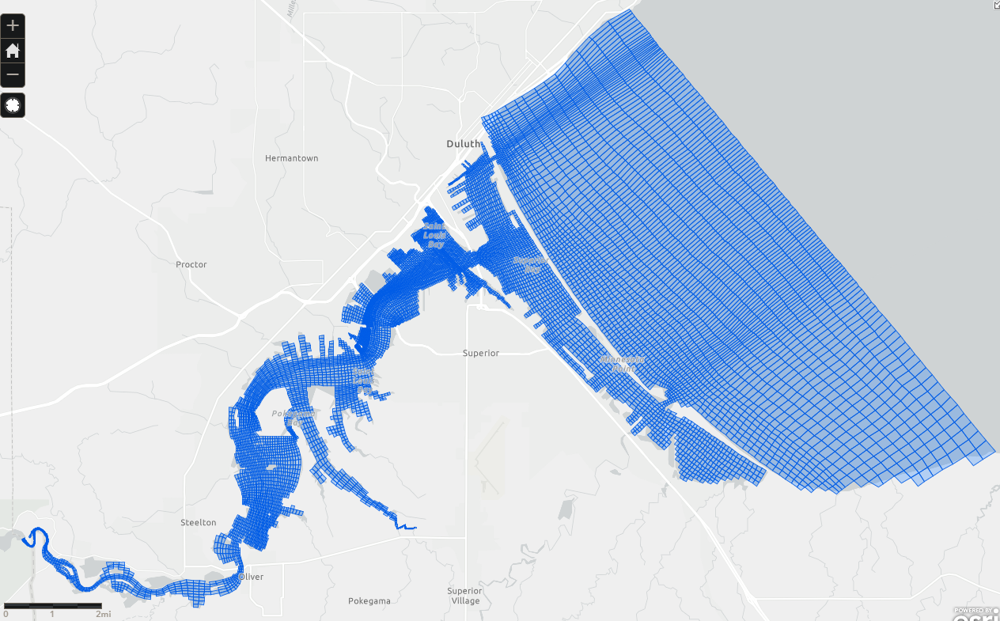
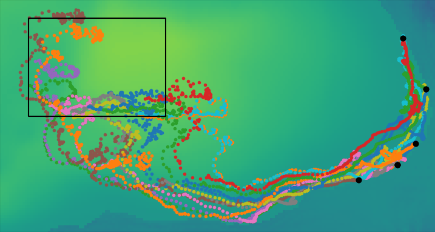

# Agent based modeling for SLRE

Terry Brown, Tom Hollenorst, Brandon Jarvis, James Pauer

USEPA

brown.terryn@epa.gov

SLRE modelling meeting Mar. 5 2024

## Early idea gathering stage

- An approach that can leverage any hydrodynamic modeling work
- Looking for specific SLRE applications
- This presentation is
  - introducing the approach
  - requesting input
  - based on a previous presentation:

## Who messed up my lake? <!-- .slide: data-state="hide-head" -->

<!-- .slide: data-background="img/front.png" data-background-size="contain" -->

<!-- ## Terry Brown, USEPA

http://tbnorth.github.io/iaglr2018

Use *Firefox*

i=0; while read; do python webshot.py '^iaglr2018$' $(printf test%02d.bmp $i) 68 5 5 5; i=$[i+1]; echo $i; done

-->

# Goals

 - Look at movement of X in the SLRE and  western Lake Superior
 - Xs from stakeholders - what moves in the Estuary that you care about?

# Agent based models

Agents:

- exist at a specific point in space
- can have multiple static and varying attributes
- can interact with surrounding agents (and grid cells)
  based on distance etc.
- added to and removed from the model over the model's
  run-time

## Agents as individuals

## Agent Based Models (ABMs) and complexity

- run ABM with thousands of agents...
- competition for food / shade
- big fish / little fish
  - how does time spent hiding impact time
    spent feeding?
- test different behaviors / foraging
  strategies

Complexity more easily represented in ABMs

## Agents for continuous phenomena

- historically agent based modeling focused on distinct
  entities (fish in streams, etc.)
- modern computational power allows large numbers of
  agents to approximate continuous phenomena
- often used to model plumes / spills

# Hydrodynamic data - Lake Michigan

 - Dong Ko, U.S. Naval Research Laboratory (NRL)
 - POM (Princeton Ocean Model), 1 x 1 km x 25 layers
 - Lake Michigan, 2003-2015
 - 3 hour time step
 - Approx. 1 Tb of data for all 13 years

## Hydrodynamic data - SLRE

EFDC model, run with particle tracing integrated

## Model overview - Lake Michigan

 - release 1 agent from each of 36 rivers each day
   - (once every 8 iterations)
 - agents released Jan. 1 are 365 days old at end of run
 - 19,236,960 records for 13,140 agents, 1.3 Gb NetCDF

# Where do they go?

 - nutrients mix / dilute / disperse, following them for 365
   days makes no sense, 7-21 days might
 - eggs, larvae etc. don't dilute, can be followed for longer
 - why not heat maps - agents spread quite thin,
   makes little difference

## NW 365 <!-- .slide: data-state="hide-head" -->

<!-- .slide: data-background="img/nw_main.png" data-background-size="contain" -->

## E Main <!-- .slide: data-state="hide-head" -->

<!-- .slide: data-background="img/e_main.png" data-background-size="contain" -->

## S Main <!-- .slide: data-state="hide-head" -->

<!-- .slide: data-background="img/s_main.png" data-background-size="contain" -->

## S Grn <!-- .slide: data-state="hide-head" -->

<!-- .slide: data-background="img/s_grn_bay.png" data-background-size="contain" -->

# Where did it come from?

Query the particle paths:

- within this box
- between these dates
- for particles in this age range

## Chicago <!-- .slide: data-state="hide-head" -->
<!-- .slide: data-background="img/chicago56.png" data-background-size="contain" -->

## Chicago <!-- .slide: data-state="hide-head" -->

<!-- .slide: data-background="img/chicago14.png" data-background-size="contain" -->

<!--

save from plt.show() after tight layout

mogrify -trim -border 10x10 -bordercolor white Figure_1* 

-->

## Anim <!-- .slide: data-state="hide-head" -->

<!--

<iframe src="https://www.youtube.com/embed/8LHHP5tMndU?rel=0&amp;controls=1&amp;showinfo=0&ecver=2" width="480" height="360" frameborder="0" style="position:absolute;width:100%;height:100%;left:0" allowfullscreen></iframe>

-->

<iframe src="https://www.youtube.com/embed/u0lZkDkwfPA?rel=0&amp;controls=1&amp;showinfo=0&ecver=2" width="480" height="360" frameborder="0" style="position:absolute;width:100%;height:100%;left:0" allowfullscreen></iframe>

## Anim <!-- .slide: data-state="hide-head" -->

<iframe src="https://www.youtube.com/embed/Tzgs4DvHcJI?rel=0&amp;controls=1&amp;showinfo=0&ecver=2" width="480" height="360" frameborder="0" style="position:absolute;width:100%;height:100%;left:0" allowfullscreen></iframe>

# Depth

# A model built on a model...

 - real world validation

# Drifters

- real life agents, for model validation and real world measurements

## Drifter <!-- .slide: data-state="hide-head" -->

<!-- .slide: data-background="img/20180524_114738-1.jpg" data-background-size="contain" -->

## Drifter <!-- .slide: data-state="hide-head" -->

## Drifter <!-- .slide: data-state="hide-head" -->

<!-- .slide: data-background="img/IMG_20180524_124736638.jpg" data-background-size="contain" -->

## Drifter <!-- .slide: data-state="hide-head" -->

<!-- .slide: data-background="img/tracker.png" data-background-size="contain" -->

## Drifter <!-- .slide: data-state="hide-head" -->

<iframe src="https://www.youtube.com/embed/gl_CFlBpERE?rel=0&amp;controls=1&amp;showinfo=0&ecver=2&start=60" width="480" height="360" frameborder="0" style="position:absolute;width:100%;height:100%;left:0" allowfullscreen></iframe>

# Questions?

Brown.TerryN@epa.gov https://tbnorth.github.io/SLREagents2024

## Animation (a bit slower) <!-- .slide: data-state="hide-head" -->

<iframe src="https://www.youtube.com/embed/04jy3JbZgic?rel=0&amp;controls=1&amp;showinfo=0&ecver=2" width="480" height="360" frameborder="0" style="position:absolute;width:100%;height:100%;left:0" allowfullscreen></iframe>

