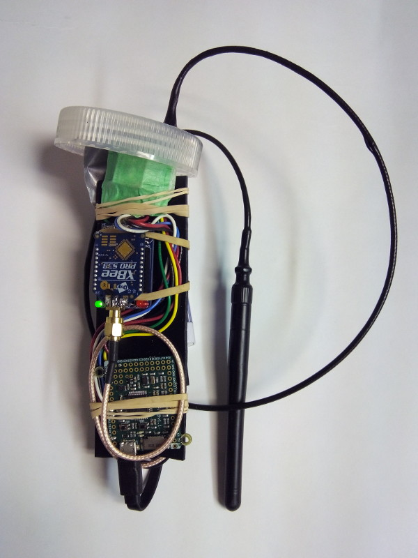

# Who messed up my lake? <!-- .slide: data-state="hide-head" -->

<!-- .slide: data-background="img/front.png" data-background-size="contain" -->

<!-- ## Terry Brown, USEPA

http://tbnorth.github.io/iaglr2018 -->

# Goals

 - Look at movement of nutrients in near shore
 - Tie land use to observed nearshore conditions
 - Examine influence on algal blooms (large scale /
   long term)
 - Look at impacts of land use decisions

# Harmful Algal Blooms

 - Public health
 - Environmental impact
 - Economic impact
 - Recreational impact

<!-- .slide: data-background="img/png/nearshore_contrib0.png" data-background-size="contain" -->
<!-- .slide: data-background-color="white" -->

<!-- .slide: data-background="img/png/nearshore_contrib1.png" data-background-size="contain" -->
<!-- .slide: data-background-color="white" -->

<!-- .slide: data-background="img/png/nearshore_contrib2.png" data-background-size="contain" -->
<!-- .slide: data-background-color="white" -->

## Drifters

- real life agents, for model validation and real world measurements

 <!-- .element height="700" -->

 <!-- .element height="700" -->

<iframe src="https://www.youtube.com/embed/gl_CFlBpERE?rel=0&amp;controls=1&amp;showinfo=0?ecver=2" width="480" height="360" frameborder="0" style="position:absolute;width:100%;height:100%;left:0" allowfullscreen></iframe>

## Agents for continuous phenomena

- historically agent based modeling focused on distinct
  entities (fish in streams, etc.)
- modern computational power allows large numbers of
  agents to approximate continuous phenomena
- often used to model plumes / spills

## Agents as individuals

## Agents

- exist at a specific point in space
- can have multiple static and varying attributes
- can interact with surrounding agents (and cells)
  based on distance etc.
- added and removed from the model over the model's
  run-time

# Future work

## Tow data

