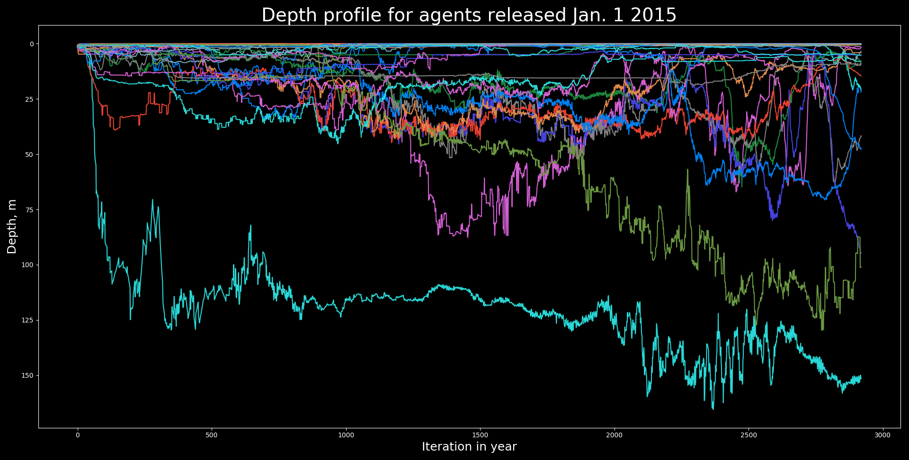
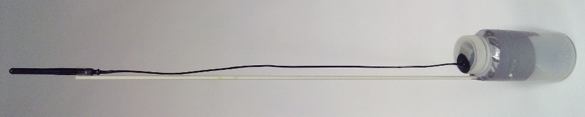
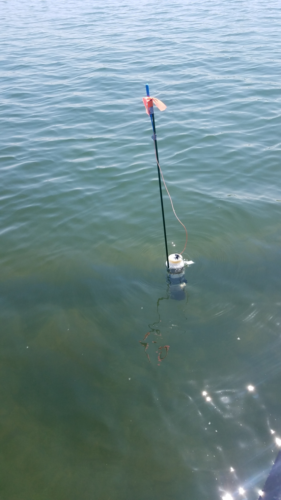
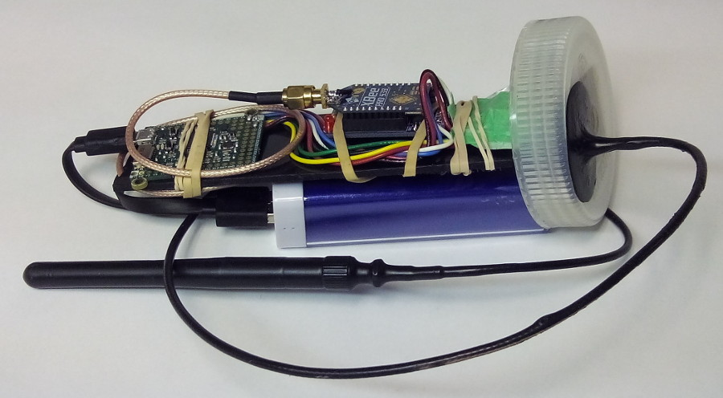
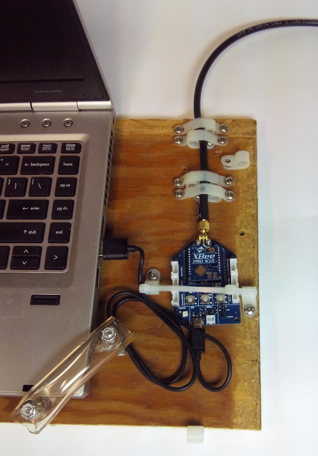

# Who messed up my lake? <!-- .slide: data-state="hide-head" -->

<!-- .slide: data-background="img/front.png" data-background-size="contain" -->

<!-- ## Terry Brown, USEPA

http://tbnorth.github.io/iaglr2018 -->


# Goals

 - Look at movement of nutrients in near shore
 - Tie land use to observed nearshore conditions
 - Examine influence on algal blooms (large scale /
   long term)
 - Look at impacts of land use decisions


# Harmful Algal Blooms

 - Public health
 - Environmental impact
 - Economic impact
 - Recreational impact


# Agents

- exist at a specific point in space
- can have multiple static and varying attributes
- can interact with surrounding agents (and cells)
  based on distance etc.
- added and removed from the model over the model's
  run-time


## Agents as individuals


## Agents for continuous phenomena

- historically agent based modeling focused on distinct
  entities (fish in streams, etc.)
- modern computational power allows large numbers of
  agents to approximate continuous phenomena
- often used to model plumes / spills


# Contrib 1 <!-- .slide: data-state="hide-head" -->
<!-- .slide: data-background="img/nearshore_contrib0.png" data-background-size="contain" -->


## Contrib 2 <!-- .slide: data-state="hide-head" -->
<!-- .slide: data-background="img/nearshore_contrib1.png" data-background-size="contain" -->


## Contrib 3 <!-- .slide: data-state="hide-head" -->
<!-- .slide: data-background="img/nearshore_contrib2.png" data-background-size="contain" -->


# Hydrodynamic data

 - Dong Ko, U.S. Naval Research Laboratory (NRL)
 - POM (Princeton Ocean Model), 1 x 1 km x 25 layers
 - Lake Michigan, 2003-2015
 - 3 hour time step
 - Approx. 1 Tb of data for all 13 years


# Model overview

 - release 1 agent from each of 36 rivers each day
   - (once every 8 iterations)
 - agents released Jan. 1 are 365 days old at end of run
 - 19,236,960 records for 13,140 agents, 1.3 Gb NetCDF
 - Vectorized Python (numpy), 90 minute run time


# Where do they go?

 - nutrients mix / dilute / disperse, following them for 365
   days makes no sense, 7-21 days might
 - eggs, larvae etc. don't dilute, can be followed for longer


## NW 365 <!-- .slide: data-state="hide-head" -->

<!-- .slide: data-background="img/nw_main.png" data-background-size="contain" -->


## E Main <!-- .slide: data-state="hide-head" -->

<!-- .slide: data-background="img/e_main.png" data-background-size="contain" -->


## S Main <!-- .slide: data-state="hide-head" -->

<!-- .slide: data-background="img/s_main.png" data-background-size="contain" -->


## S Grn <!-- .slide: data-state="hide-head" -->

<!-- .slide: data-background="img/s_grn_bay.png" data-background-size="contain" -->


# Where did it come from?

```
python nsagent_contrib.py --start 20150901 --end 20150907 \
  testconf.json /mnt/edata/edata/large/nsagents/lastrun.nc \
  --max-age 56 --WSEN -87.9012 41.6959 -87.4333 42.1807 \
  --lbrt 0 0 155 150
Reporting iterations 1944-1992
Reporting from 9,11
Reporting to 63,48
425952 records in interval
Selected 5994 records by bounds
Selected 3696 records by age
Selected 163 agents
```
.


## Chicago <!-- .slide: data-state="hide-head" -->
<!-- .slide: data-background="img/chicago56.png" data-background-size="contain" -->


## Chicago <!-- .slide: data-state="hide-head" -->
<!-- .slide: data-background="img/chicago14.png" data-background-size="contain" -->

<!--

save from plt.show() after tight layout

mogrify -trim -border 10x10 -bordercolor white Figure_1* 

-->


# Depth




# Drifters

- real life agents, for model validation and real world measurements




## Drifter <!-- .slide: data-state="hide-head" -->
 <!-- .element height="700" -->


## Drifter <!-- .slide: data-state="hide-head" -->



## Drifter <!-- .slide: data-state="hide-head" -->
 <!-- .element height="700" -->


## Drifter <!-- .slide: data-state="hide-head" -->
<div style="position:relative;height:0;padding-bottom:75.0%"><iframe src="https://www.youtube.com/embed/gl_CFlBpERE?rel=0&amp;controls=1&amp;showinfo=0&ecver=2&start=60" width="480" height="360" frameborder="0" style="position:absolute;width:100%;height:100%;left:0" allowfullscreen></iframe></div>


# Future work

 -  Tow data

Brown.TerryN@epa.gov

